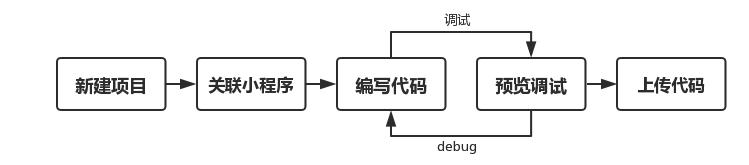
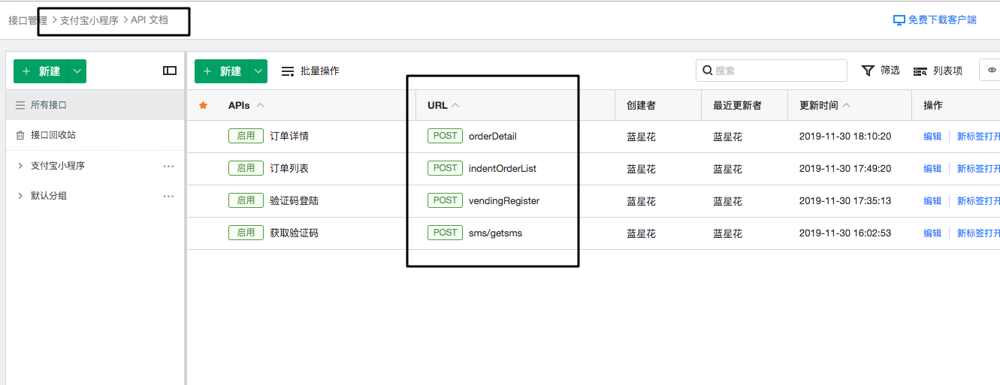
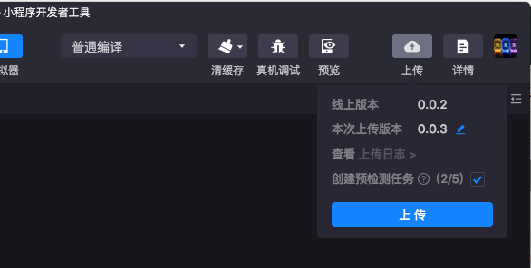
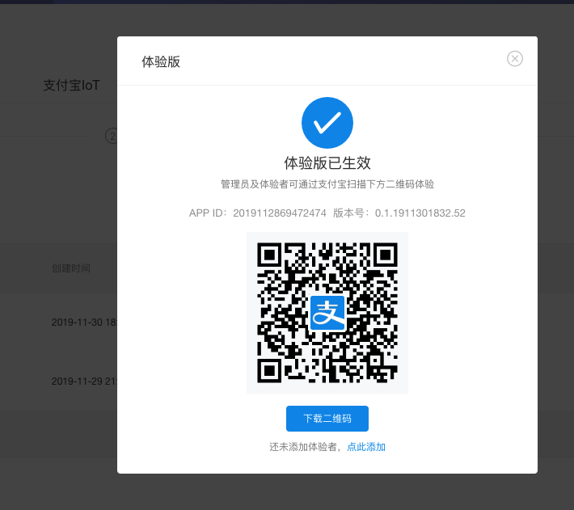

## 支付宝小程序学习demo

---
支付宝小程序开发者管理后台：https://openhome.alipay.com/mini/dev/detail

---
## 一、前言
为了方便学习，后台数据我们通过mock：https://www.eolinker.com/#/home/ams/project/?spaceKey=Jg8bGQufac817448ed5572ce2af5fe86fcfc1104a8e8913

直接用app.js中mock_server的地址即可。后面数据json格式会給出来。

---

进入主界面之后，IDE 会通过弹窗提示 扫码登录 以及 关联小程序。

