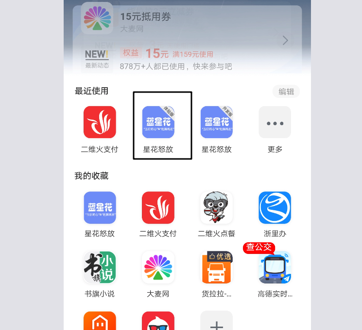

## 后台程序员学习支付宝小程序

---
支付宝小程序开发者管理后台：https://openhome.alipay.com/mini/dev/detail


---
## 一、前言
为了方便学习，后台数据我们通过mock：
```html
https://www.eolinker.com/#/home/ams/project/?spaceKey=Jg8bGQufac817448ed5572ce2af5fe86fcfc1104a8e8913
```
直接用app.js中mock_server的地址即可。后面数据json格式会給出来。


---


进入主界面之后，IDE 会通过弹窗提示 扫码登录 以及 关联小程序。





---
## 二、接口
1.获取验证码
https://result.eolinker.com/cVtaWmta00f18e77f692b959607fad97d41a69fbb9ef529?uri=sms/getsms
```json
{
    "code":0
}
```


2.验证码登陆
https://result.eolinker.com/cVtaWmta00f18e77f692b959607fad97d41a69fbb9ef529?uri=vendingRegister
```json
{
    "code":0,
    "data":{
        "avatar":"https://tfs.alipayobjects.com/images/partner/T1m7RpXXNaXXXXXXXX",
        "nickname":"星的节奏",
        "mobile":"18379643331",
        "uid":"xxxxxxxxx",
        "token":"18379643331xxxxxxxx"
    }
}
```


3.订单列表
https://result.eolinker.com/cVtaWmta00f18e77f692b959607fad97d41a69fbb9ef529?uri=indentOrderList
```json
{
    "code":0,
    "data":[
        {
            "orderState":"7",
            "isCk":"1",
            "orderNo":"OrderNo100000",
            "orderTime":"2019-10-22 22:15",
            "machineName":"收银台1",
            "goodsNum":10,
            "payAmount":200,
            "memberReduce":180,
            "machineIndentCountList":[
                {
                    "goodsImage":"https://assets.2dfire.com/frontend/dfe976b988f13981d94f8228c0aaa505.png",
                    "goodsNumber":40,
                    "goodsOriginal":280,
                    "goodsName":"农家小炒肉套餐"
                }
            ]
        },
        {
            "orderState":"7",
            "isCk":"1",
            "orderNo":"OrderNo100000",
            "orderTime":"2019-10-22 22:15",
            "machineName":"收银台1",
            "goodsNum":10,
            "payAmount":200,
            "memberReduce":180,
            "machineIndentCountList":[
                {
                    "goodsImage":"https://assets.2dfire.com/frontend/dfe976b988f13981d94f8228c0aaa505.png",
                    "goodsNumber":40,
                    "goodsOriginal":280,
                    "goodsName":"农家小炒肉套餐"
                }
            ]
        }
    ]
}
```

4.订单详情
https://result.eolinker.com/cVtaWmta00f18e77f692b959607fad97d41a69fbb9ef529?uri=orderDetail
```json
{
    "code":0,
    "data":{
        "isCk":1,
        "orderTime":"2019-10-22 22:15",
        "orderState":"7",
        "machineName":"收银台1",
        "orderNo":"OrderNo100000",
        "goodsList":[
            {
                "goodsID":"goodid0001",
                "goodsImage":"https://assets.2dfire.com/frontend/dfe976b988f13981d94f8228c0aaa505.png",
                "goodsName":"农家小炒肉",
                "memberPrice":"200",
                "goodsOriginal":"280",
                "goodsNumber":1
            },
            {
                "goodsID":"goodid0001",
                "goodsImage":"https://assets.2dfire.com/frontend/dfe976b988f13981d94f8228c0aaa505.png",
                "goodsName":"农家小炒肉",
                "memberPrice":"200",
                "goodsOriginal":"280",
                "goodsNumber":1
            }
        ],
        "couponReduce":"20",
        "memberReduce":"180",
        "integralReduce":"OrderNo100000",
        "balanceReduce":"20",
        "goodsNum":10,
        "payAmount":200,
        "goodsPrice":1980
    }
}
```

---


